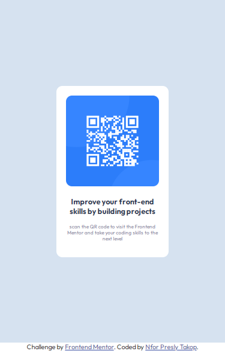
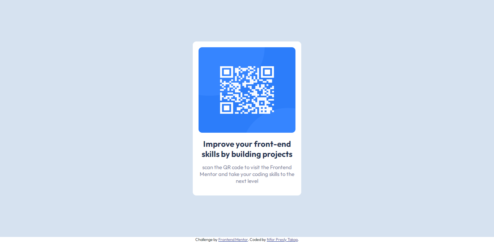

# Frontend Mentor - QR code component solution

This is a solution to the [QR code component challenge on Frontend Mentor](https://www.frontendmentor.io/challenges/qr-code-component-iux_sIO_H). Frontend Mentor challenges help you improve your coding skills by building realistic projects. 

## Table of contents

- [Overview](#overview)
  - [Screenshot](#screenshot)
  - [Built with](#built-with)
  - [Continued development](#continued-development)
  - [Useful resources](#useful-resources)
- [Author](#author)

**Note: Delete this note and update the table of contents based on what sections you keep.**

## Overview

### Screenshot
- 
- 
###  Link
- [live link]( https://nfor2000.github.io/QR-code-component-challenge-on-Frontend-Mentor/)
### Built with

- Semantic HTML5 markup
- CSS custom properties
- Flexbox
- Media query 

### Continued development
- Javascript click events, css grid ,and flexbox
### Useful resources

- Imported font-style(Outfit) from google fonts

## Author

- Website - [Nfor Presly Takop](https://www.your-site.com)
- Frontend Mentor - [@nfor2000](https://www.frontendmentor.io/profile/nfor2000)
- Twitter - [@PreslyNfor](https://www.twitter.com/PreslyNfor)

